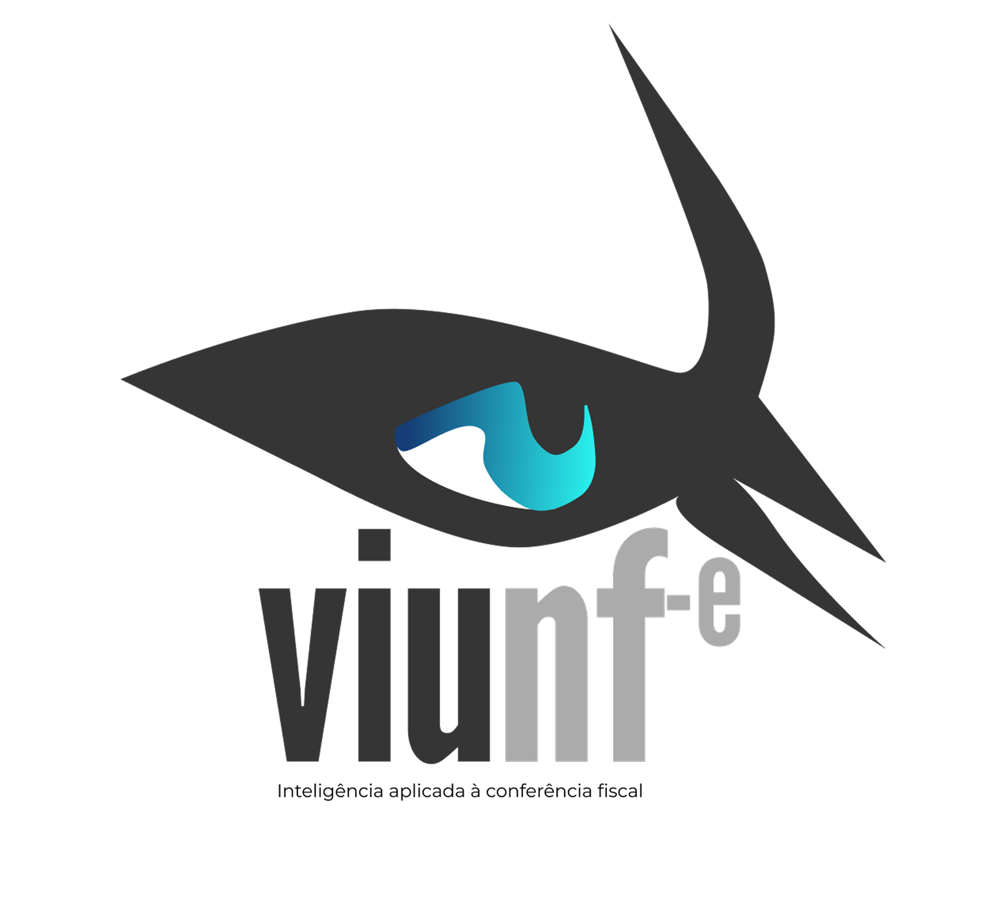

# Hi, I'm Nadianne Galvão 👋

I'm a **Master's student in Computer Science at the Federal University of Sergipe (UFS)**, with a postgraduate specialization in **Information Security** and a Bachelor's degree in **Information Systems**.

My work and interests connect **software development, cybersecurity, academic research, and digital product development**.

I have hands-on experience in **Blue Team, vulnerability management, security research**, and I'm currently returning to **Bug Bounty and offensive security studies**.

In 2025, I achieved **1st place in the Cybersecurity Technological Residency – Blue Team by RNP**, as part of the Hackers do Bem program.

---

## 🚀 Currently building

  

### VIU NF-e

A digital product focused on applying technology and intelligence to **tax document verification**.

I contribute to its **software development, product evolution, feature definition, and technical decisions**.

---

## 🔬 Research & Security

* Cybersecurity
* Software Security
* Vulnerability Analysis
* Bug Bounty
* DDoS Detection
* Machine Learning applied to Security
* Digital Health & Privacy Research

---

## 💻 Development & Technologies

**Languages**
`Python` · `TypeScript` · `JavaScript` · `C#` · `SQL`

**Frameworks & Web**
`Next.js` · `React`

**Data & Infrastructure**
`PostgreSQL` · `Supabase` · `Docker` · `Git`

---

## 🔐 Security

`Linux` · `OpenVAS / GVM` · `Nmap` · `OWASP ZAP` · `Burp Suite` · `DefectDojo` · `Wireshark`

---

## 🔬 Research & Tools

**Tools**
`Jupyter` · `LaTeX` · `GitHub` · `Figma` · `Fedora`

**Research Interests**

* Cybersecurity
* Software Security
* Vulnerability Analysis
* Bug Bounty
* DDoS Detection
* Machine Learning applied to Security
* Privacy & Security in Digital Health
* Software Engineering

---

## 🌐 Connect

---

> *"Let us not become weary in doing good, for at the proper time we will reap a harvest if we do not give up."*
> **Galatians 6:9**
